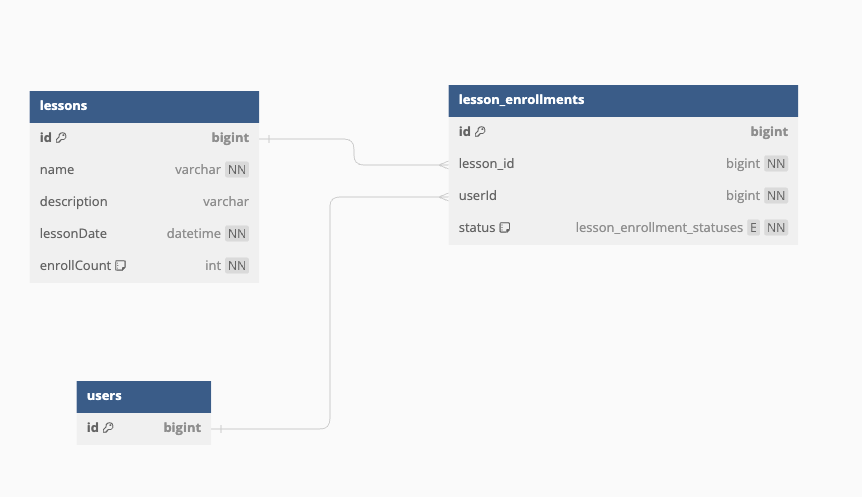

# ERD diagram:



### Note

- dbdiagram.io 에 아래의 내용을 입력하여 ERD를 그렸습니다:

```agsl
Table lessons as L {
  id bigint [pk]
  name varchar [not null]
  description varchar
  lessonDate datetime [not null]
  enrollCount int [not null, default: 0]
}

enum lesson_enrollment_statuses {
  ENROLL
  WITHDRAW
}
Table lesson_enrollments as LE {
  id bigint [pk]
  lesson_id bigint [not null, ref: > L.id]
  userId bigint [not null, ref: > U.id]
  status lesson_enrollment_statuses [not null]
}

Table users as U {
  id bigint [pk]
}
```
